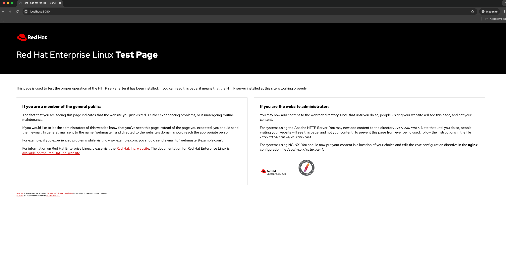
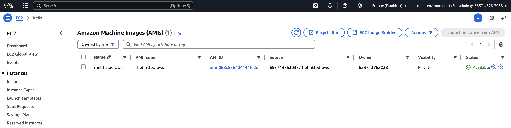
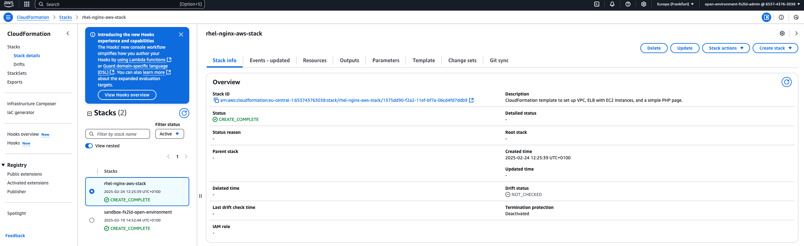

### How to use RHEL Image Mode on AWS

Prerequisites:

* AWS Account and credentials setup (e.g. aws configure - see reference https://docs.aws.amazon.com/cli/latest/userguide/cli-chap-welcome.html)
  * This guide will generate costs, please keep an eye on them and delete unused resources at the end! *IMPORTANT* 
* Subscribed RHEL 9 system (Workstation/VM)
* Image Registry like quay.io 
* Installed Dev-Tools
* * VSCodium or similar file editor
* * podman
* * bootc
* * aws-cli

I use a MacBook Pro M3 for that example hence everything build on the host and uploaded to AWS is arm64 architecture. 
For x86_64 based systems you need to change the image type accordingly.


## What is the goal of the article?

Running an Web-Server on a RHEL System on AWS.

## Services used:

* S3 for saving the RHEL Images and create the AMI (Amazon Machine Images - see reference https://docs.aws.amazon.com/AWSEC2/latest/UserGuide/AMIs.html)  
* AWS ELB  
* “podman” for image creation, testing and pushing the generated AMIs  
* “cloud-init” for deploying the AMIs


## STEP 1 "Create github repo"

Create a github repo on github.com named "rhel-image-mode-with-aws".

 ```bash
cd $USERHOME #Change to $HOME
git clone git@github.com:$YOURGITHUBUSER/rhel-image-mode-with-aws.git
cd rhel-image-mode-with-aws #Change into our working directory
```

## STEP 2 "Create your Containerfile for the RHEL Image"

Containerfile:

```bash
FROM registry.redhat.io/rhel9/rhel-bootc:9.5

#install the lamp components
RUN dnf module enable -y nginx:1.24 && dnf install -y httpd cloud-init && dnf clean all

#start the services automatically on boot
RUN systemctl enable httpd
```

As you can see the image will contain the nginx web-server and the cloud-init package which is needed to
configure the system during the deployment on AWS.

## STEP 3 "Build the RHEL Image"

Create and login to the registry by visiting https://access.redhat.com/terms-based-registry and click “New service account”.
After creation copy the "docker login" and run the command but before change "docker" to "podman":


```bash
podman login -u='11[...]03|domi-nik-' -p=eyJhbGci[...]DZBxqfQ registry.redhat.io
#as you need evelated to convert the container image to a disk image repeast the command with sudo
sudo podman login -u='11[...]03|domi-nik-' -p=eyJhbGci[...]DZBxqfQ registry.redhat.io
```

You should get back the following:

```bash
Login Succeeded!
```

Pull the "rhel-bootc" base image:

```bash
podman pull registry.redhat.io/rhel9/rhel-bootc:9.5
´´´

Now let's build the image and tag the image:

```bash
podman build -f Containerfile -t quay.io/$YOUR_QUAY_ACCOUNT_NAME/rhel-nginx-bootc:latest
```
In my example $YOUR_QUAY_ACCOUNT_NAME equals "dbittl".


## STEP 4 "Test the Image"

Run the image with podman:

```bash
podman run -d --rm --name nginx -p 8080:80 quay.io/$YOUR_QUAY_ACCOUNT_NAME/rhel-nginx-bootc:latest /sbin/init
```

Access your Web-Server on http://localhost:8080 and you should see this:


 

If all worked, you can stop the running container with:

```bash
podman stop nginx
```

## STEP 5 "Push the image to the registry"

```bash
podman login quay.io
podman push quay.io/$YOUR_QUAY_ACCOUNT_NAME/rhel-nginx-bootc:latest
```

And again you should see this:

```bash
Login Succeeded!
```

and this:

```bash

```

Now please set this image to "public" on quay.io so that we can use and install it remotely via e.g. Kickstarter.
But this is not what we want to do now, instead wo go on with building our AMI for AWS, hence you could have skipped this part
but I wanted to show this to you as well. 

## STEP 6 "Build the RHEL Image as AMI and push it to AWS S3 bucket"

To seperate the image name from the boot-c image we will add an additional tag to the image called "rhel-nginx-aws".

```bash
podman tag quay.io/$YOUR_QUAY_ACCOUNT_NAME/rhel-nginx-bootc:latest quay.io/$YOUR_QUAY_ACCOUNT_NAME/rhel-nginx-aws:latest
```

and now push it again to your quay.io registry:

```bash
podman push quay.io/dbittl/rhel-nginx-aws:latest

```

The following script will create the S3 Bucket, Role and Policies needed, build and push the AMI to AWS.
You can find the scipt in the repo with the name "generate_AMI.sh".
You have to adjust the variables to match your environment e.g. the $REGISTRY_URL!


```bash
#!/bin/bash

set -e  # Abort script on any error

ROLE_NAME="vmimport"
POLICY_NAME="vmimport-s3-policy"
REGISTRY_URL="quay.io/dbittl"
IMAGE="rhel-nginx-aws:latest"
AWS_REGION="eu-central-1"
BUCKET_PREFIX="rhel-ami-import"

# Step 1: Check if an S3 bucket with the prefix already exists
EXISTING_BUCKET=$(aws s3api list-buckets --query "Buckets[?starts_with(Name, '$BUCKET_PREFIX')].Name" --output text)

if [ -n "$EXISTING_BUCKET" ]; then
    echo "Found existing bucket: $EXISTING_BUCKET"
    export BUCKET_NAME="$EXISTING_BUCKET"
else
    echo "Creating a new S3 bucket..."
    export BUCKET_NAME="${BUCKET_PREFIX}-$(uuidgen | tr -d - | tr '[:upper:]' '[:lower:]')"
    
    aws s3api create-bucket \
        --bucket "$BUCKET_NAME" \
        --region $AWS_REGION \
        --create-bucket-configuration LocationConstraint=$AWS_REGION

    echo "S3 bucket '$BUCKET_NAME' created successfully!"
fi

# Step 2: Check if the IAM role already exists
if aws iam get-role --role-name $ROLE_NAME >/dev/null 2>&1; then
    echo "Role '$ROLE_NAME' already exists. Skipping creation."
else
    echo "Creating IAM role '$ROLE_NAME'..."

    # Create Trust Policy for VM Import
    cat > trust-policy.json <<EOF
{
   "Version": "2012-10-17",
   "Statement": [
      {
         "Effect": "Allow",
         "Principal": { "Service": "vmie.amazonaws.com" },
         "Action": "sts:AssumeRole",
         "Condition": {
            "StringEquals":{
               "sts:Externalid": "vmimport"
            }
         }
      }
   ]
}
EOF

    # Create Role
    aws iam create-role --role-name $ROLE_NAME --assume-role-policy-document file://trust-policy.json
    rm trust-policy.json #Cleanup
    echo "IAM Role '$ROLE_NAME' created successfully!"
fi

# Step 3: Check if the policy is already attached
if aws iam get-role-policy --role-name $ROLE_NAME --policy-name $POLICY_NAME >/dev/null 2>&1; then
    echo "Policy '$POLICY_NAME' is already attached to the role '$ROLE_NAME'. Skipping policy creation."
else
    echo "Creating and attaching policy '$POLICY_NAME' to role '$ROLE_NAME'..."

    # Create Role-Policy for S3 Access
    cat > role-policy.json <<EOF
{
   "Version":"2012-10-17",
   "Statement":[
      {
         "Effect": "Allow",
         "Action": [
            "s3:GetBucketLocation",
            "s3:GetObject",
            "s3:ListBucket" 
         ],
         "Resource": [
            "arn:aws:s3:::$BUCKET_NAME",
            "arn:aws:s3:::$BUCKET_NAME/*"
         ]
      },
      {
         "Effect": "Allow",
         "Action": [
            "s3:GetBucketLocation",
            "s3:GetObject",
            "s3:ListBucket",
            "s3:PutObject",
            "s3:GetBucketAcl"
         ],
         "Resource": [
            "arn:aws:s3:::$BUCKET_NAME",
            "arn:aws:s3:::$BUCKET_NAME/*"
         ]
      },
      {
         "Effect": "Allow",
         "Action": [
            "ec2:ModifySnapshotAttribute",
            "ec2:CopySnapshot",
            "ec2:RegisterImage",
            "ec2:Describe*"
         ],
         "Resource": "*"
      }
   ]
}
EOF

    # Attach the policy to the role
    aws iam put-role-policy --role-name $ROLE_NAME --policy-name $POLICY_NAME --policy-document file://role-policy.json
    rm role-policy.json #Clenaup
    echo "Policy '$POLICY_NAME' attached successfully!"
fi

# Step 4: Start the Podman container
echo "Starting Podman container for AMI build and copy to S3..."
sudo podman run --rm -it --privileged \
    --pull=newer \
    --security-opt label=type:unconfined_t \
    -v $HOME/.aws:/root/.aws:ro \
    --env AWS_PROFILE=default \
    registry.redhat.io/rhel9/bootc-image-builder:latest \
    --type ami \
    --aws-ami-name rhel-nginx-aws \
    --aws-bucket $BUCKET_NAME \
    --aws-region $AWS_REGION \
    $REGISTRY_URL/$IMAGE
```

After the script has finished you should see something like this:

```bash
[...]
manifest - finished successfully
build:          29bd086ee3531b2c67d1ca22dc30c4dfe0c37d6622fdd342abb0bd80c916819b
image:          8cdac98c28ec498cdea57535c31c6f170964e9ba7f42348b57b1fda37533d298
qcow2:          8bf45f56087ccb8543a04845a7e88e8af1de24ed37361de4e614815e5bdd03bf
vmdk:           104d54e3ba707be30865286bdb2d394f333245859fc7e2498449285fd6d1c743
vpc:            6fb8e75d969bfdb610090f34ed461b6319971837036d13a84bfc1bfd0462ab81
ovf:            ab64a9e4a83ee465e3d26ab25ddba0074af1127d79139e6690cdf6d3e01af1f6
archive:        7e4d332f9b5bba051f0f5efe7ebd96bae3eeaa2fe9a0ae2e948d3cb532d632ec
gce:            ec886a7f5be20698f5d40a2bbe323dacae502b8aef28ff0c6ea62920d948ef32
Build complete!
Uploading image/disk.raw to rhel-ami-importc9eda16cfb6c47b6999a97743102cbed:89a83267-5178-44f6-b004-515ff5943577-disk.raw
10.00 GiB / 10.00 GiB [--------------------------------------------------------------------------------------------------------------------------------------------------------------------------------------------------------------------------------------------------] 100.00% 3.71 MiB p/s
File uploaded to https://rhel-ami-importc9eda16cfb6c47b6999a97743102cbed.s3.eu-central-1.amazonaws.com/89a83267-5178-44f6-b004-515ff5943577-disk.raw
Registering AMI rhel-nginx-aws
Deleted S3 object rhel-ami-importc9eda16cfb6c47b6999a97743102cbed:89a83267-5178-44f6-b004-515ff5943577-disk.raw
AMI registered: ami-0d74dbf7474a1b822
Snapshot ID: snap-01714d960cd6fde44
```

How does it look in the AWS Webconsole?




## STEP 6 "Now let's create the AWS environment for us"

For that you can use the cloudfront-template file "setup-aws-environment.yml".
This will do the following:

* A VPC, subnets, security group, and necessary routing components are set up.
* Two EC2 instances are created and configured to serve a basic PHP page.
* An Elastic Load Balancer distributes HTTP traffic to these instances to ensure high availability across different availability zones.
* The PHP page is accessible through the ELB's public DNS name.


To emphasize the cloud-init functionality once again, here is the current section from the cloudfront-template to adjust your RHEL Instance during creation - according to your preferences:

```bash
      UserData:
        Fn::Base64: |
          #!/bin/bash
          echo '<h1 style="text-align:center;">Welcome to image mode for RHEL</h1> <?php phpinfo(); ?>' > /var/www/html/index.php
```


Please adjust the ImageId value according to your environment before the execution!
If you work with a x86_64 architecture, you can also change our InstanceType to e.g. "t3.micro" if you like.

```bash
aws cloudformation create-stack --stack-name rhel-nginx-aws-stack \
  --template-body file://setup-aws-environment.yml \
  --parameters ParameterKey=ImageId,ParameterValue=ami-0d74dbf7474a1b822 \
               ParameterKey=InstanceType,ParameterValue=t4g.micro
```


You can verify the stack creation process with

```bash
aws cloudformation describe-stacks --stack-name rhel-nginx-aws-stack

```

How does it look inthe AWS Webconsole again?




Once the deployment is finished you can get the DNS-Name of your Loadbalancer via:

```bash
aws elbv2 describe-load-balancers --names rhel-nginx-aws-stack-ELB --query 'LoadBalancers[0].DNSName' --output text
```

Open your deployed website in your browser.


## Conclusion

Whast have we achieved?


## Why should I use “Image Mode”? Or what are the benefits of using it?

* Container Like behavior  
* Use DevOps Principles  
* Easy (automatic) upgrades and rollbacks  
* OStree based RHEL installs (one-time task)  
* Makes it also super easy for a fleet of Edge Devices