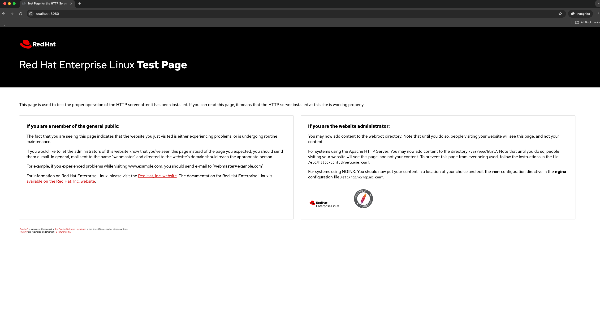

### How to use RHEL Image Mode on AWS

Prerequisites:

* AWS Account and credentials setup (e.g. aws configure - see reference https://docs.aws.amazon.com/cli/latest/userguide/cli-chap-welcome.html)
* Subscribed RHEL 9 system (Workstation/VM)
* Image Registry like quay.io  
* (Preconfigured Github Account with ssh-key authentication)  
* Installed Dev-Tools
* * VSCodium or similar file editor
* * podman
* * bootc


## What is the goal of the article?

Running an Web-Server on a RHEL System on AWS.

## Services used:

* S3 for saving the RHEL Images and create the AMI (Amazon Machine Images - see reference https://docs.aws.amazon.com/AWSEC2/latest/UserGuide/AMIs.html)  
* AWS ELB  
* “podman” for image creation, testing and pushing the generated AMIs  
* “cloud-init” for deploying the AMIs


## STEP 1 "Create github repo"

Create a github repo on github.com named "rhel-image-mode-with-aws".

 ```bash
cd $USERHOME #Change to $HOME
git clone git@github.com:$YOURGITHUBUSER/rhel-image-mode-with-aws.git
cd rhel-image-mode-with-aws #Change into our working directory
```

## STEP 2 "Create your Containerfile for the RHEL Image"

Containerfile:

```bash
FROM registry.redhat.io/rhel9/rhel-bootc:9.5

#install the lamp components
RUN dnf module enable -y nginx:1.24 && dnf install -y httpd cloud-init && dnf clean all

#start the services automatically on boot
RUN systemctl enable httpd
```

As you can see the image will contain the nginx web-server and the cloud-init package which is needed to
configure the system during the deployment on AWS.

## STEP 3 "Build the RHEL Image"

Create and login to the registry by visiting https://access.redhat.com/terms-based-registry and click “New service account”.
After creation copy the "docker login" and run the command but before change "docker" to "podman":


```bash
podman login -u='11[...]03|domi-nik-' -p=eyJhbGci[...]DZBxqfQ registry.redhat.io
#as you need evelated to convert the container image to a disk image repeast the command with sudo
sudo podman login -u='11[...]03|domi-nik-' -p=eyJhbGci[...]DZBxqfQ registry.redhat.io
```

You should get back the following:

```bash
Login Succeeded!
```

Pull the "rhel-bootc" base image:

```bash
podman pull registry.redhat.io/rhel9/rhel-bootc:9.5
´´´

Now let's build the image and tag the image:

```bash
podman build -f Containerfile -t quay.io/$YOUR_QUAY_ACCOUNT_NAME/rhel-nginx-bootc:latest
```
In my example $YOUR_QUAY_ACCOUNT_NAME equals "dbittl".


## STEP 4 "Test the Image"

Run the image with podman:

```bash
podman run -d --rm --name nginx -p 8080:80 quay.io/$YOUR_QUAY_ACCOUNT_NAME/rhel-nginx-bootc:latest /sbin/init
```

Access your Web-Server on http://localhost:8080 and you should see this:


 

If all worked, you can stop the running container with:

```bash
podman stop nginx
```

## STEP 5 "Push the image to the registry"

```bash
podman login quay.io
podman push quay.io/$YOUR_QUAY_ACCOUNT_NAME/rhel-nginx-bootc:latest
```

And again you should see this:

```bash
Login Succeeded!
```

and this:

```bash

```

Now please set this image to "public" on quay.io so that we can use and install it remotely via e.g. Kickstarter.
But this is not what we want to do now, instead wo go on with building our AMI for AWS, hence you could have skipped this part
but I wanted to show this to you as well. 

## STEP 6 "Build the RHEL Image as AMI and push it to AWS S3 bucket"

To seperate the image name from the boot-c image we will add an additional tag to the image called "rhel-nginx-aws".

```bash
podman tag quay.io/$YOUR_QUAY_ACCOUNT_NAME/rhel-nginx-bootc:latest quay.io/$YOUR_QUAY_ACCOUNT_NAME/rhel-nginx-aws:latest
```

and now push it again to your quay.io registry:

```bash
podman push quay.io/dbittl/rhel-nginx-aws:latest

```

Before the next step create your S3 bucket and AWS service role:

Bucket creation:

```bash
export BUCKET_NAME=$(aws s3api create-bucket \
    --bucket rhel-nginx-aws-bucket$(uuidgen | tr -d - | tr '[:upper:]' '[:lower:]' ) \
    --region eu-central-1 \
    --create-bucket-configuration LocationConstraint=eu-central-1 \
    --output json | jq -r '.Location' | sed -E 's|http://(.*)\.s3.amazonaws.com/|\1|')

#the variable $BUCKET_NAME will be used in the next step, to identify the newly created S3 bucket
```

Service role and policy creation:

```bash
#trust-policy:
aws iam create-role --role-name vmimport --region eu-central-1 --assume-role-policy-document '{
   "Version": "2012-10-17",
   "Statement": [
      {
         "Effect": "Allow",
         "Principal": { "Service": "vmie.amazonaws.com" },
         "Action": "sts:AssumeRole",
         "Condition": {
            "StringEquals":{
               "sts:Externalid": "vmimport"
            }
         }
      }
   ]
}'

#put-role-policy
aws iam put-role-policy --role-name vmimport --region eu-central-1 --policy-name vmimport --policy-document '{
   "Version":"2012-10-17",
   "Statement":[
      {
         "Effect": "Allow",
         "Action": [
            "s3:GetBucketLocation",
            "s3:GetObject",
            "s3:ListBucket" 
         ],
         "Resource": [
            "arn:aws:s3:::rhel-nginx-aws-bucketca8c14e621804fa9a47741c442a9569e",
            "arn:aws:s3:::rhel-nginx-aws-bucketca8c14e621804fa9a47741c442a9569e/*"
         ]
      },
      {
         "Effect": "Allow",
         "Action": [
            "s3:GetBucketLocation",
            "s3:GetObject",
            "s3:ListBucket",
            "s3:PutObject",
            "s3:GetBucketAcl"
         ],
         "Resource": [
            "arn:aws:s3:::amzn-s3-demo-export-bucket",
            "arn:aws:s3:::amzn-s3-demo-export-bucket/*"
         ]
      },
      {
         "Effect": "Allow",
         "Action": [
            "ec2:ModifySnapshotAttribute",
            "ec2:CopySnapshot",
            "ec2:RegisterImage",
            "ec2:Describe*"
         ],
         "Resource": "*"
      }
   ]
}'

```


Finally build the AMI and push it to your S3 bucket from the newly tagged and pushed quay-image with this command:

```bash
sudo podman run --rm -it --privileged \
 --pull=newer \
 --security-opt label=type:unconfined_t \
 -v $XDG_RUNTIME_DIR/containers/auth.json:/run/containers/0/auth.json \
 -v $HOME/.aws:/root/.aws:ro \
 --env AWS_PROFILE=default \
 registry.redhat.io/rhel9/bootc-image-builder:latest \
 --type ami \
 --aws-ami-name rhel-nginx-aws \
 --aws-bucket $BUCKET_NAME \
 --aws-region eu-central-1 \
 quay.io/$YOUR_QUAY_ACCOUNT_NAME/rhel-nginx-aws:latest #the newly tagged and pushed image from above
```

After the command has finished you should see something like this:

```bash
[...]
manifest - finished successfully
build:          29bd086ee3531b2c67d1ca22dc30c4dfe0c37d6622fdd342abb0bd80c916819b
image:          156802a1e7f05ad5617232cbcdc84773b863c31da154eba6992e7f5956b79ce1
qcow2:          312b492a68f05f5a325262b6ae5df4c15981fb9161c67cb7c2817941a2c90eb5
vmdk:           d3d4dd454e2f47df96c97757ccbc893abab52d2a21c8c7f7d7b785ebfad66d20
vpc:            f8c970ecdea42d3db2189bd71085486111dd92dc1e4f23b8f95d14787279993a
ovf:            273d50674aa92bfdf554bbe514c1a8de5a1d4945b6133136e1a1736ae772a9aa
archive:        b83b2e4d87c6e96066c38b5db997b4e58278748a5a4b387252e8fdc360147eb4
gce:            83a50c057e40f6ef97ae2422cca903276f7de47e222747ffdb7818879f0438dd
Build complete!
Uploading image/disk.raw to rhel-nginx-aws-bucket:7287e3e6-1bb9-4429-a298-decb98f32d43-disk.raw
1.25 GiB / 10.00 GiB [------------------------------>_____________________________________________
```

If you need more information or command options, please see the reference here: https://github.com/osbuild/bootc-image-builder?tab=readme-ov-file#amazon-machine-images-amis


## STREP X "Setup cloud-init"

Add an individual homepage to every instance that will be deployed:

```bash
#create an awe inspiring home page!
RUN echo '<h1 style="text-align:center;">Welcome to image mode for RHEL</h1> <?php phpinfo(); ?>' >> /var/www/html/index.php
```


## Conclusion

Whast have we achieved?


## Why should I use “Image Mode”? Or what are the benefits of using it?

* Container Like behavior  
* Use DevOps Principles  
* Easy (automatic) upgrades and rollbacks  
* OStree based RHEL installs (one-time task)  
* Makes it also super easy for a fleet of Edge Devices